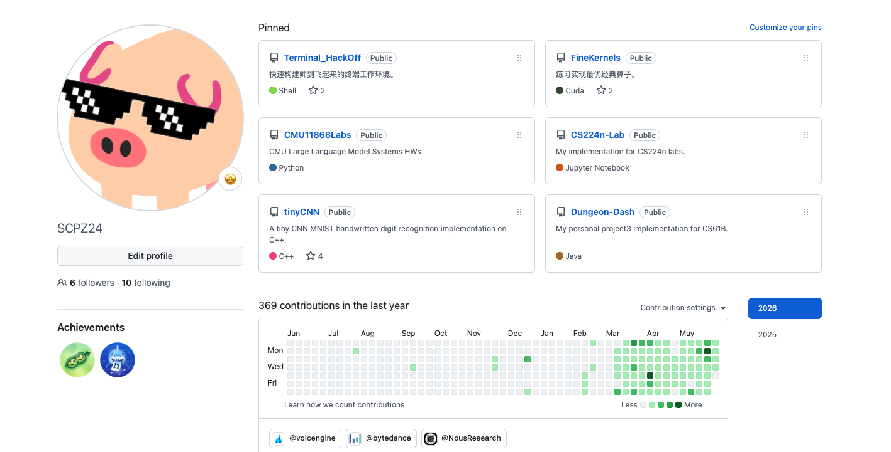
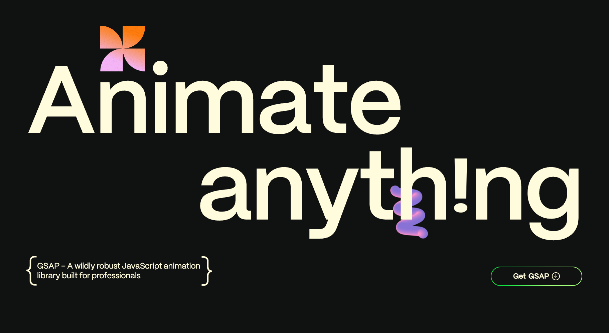

# AgentFlow Salon --EP2

by ZYT

---



---
> Using --- as page separator.

## AI新闻

---

- DeepSeek-v4-pro永久降价
- Gemini全模态新模型发布
- Codex/Claude发布Goal模式
- 豆包即将推出付费产品


---

## HTML-PPT

URL: https://github.com/lewislulu/html-ppt-skill

既然AI做不明白PPT...
改用html
- ai原生
- 化静为动

---


---

SKILL安装：

先得有nodeJS环境

安装全局openskills
```bash
npm install openskills
```

在工作目录安装skill
```bash
cd path/to/working/directory

openskills install https://github.com/lewislulu/html-ppt-skill

openskills sync
```

---


## DeerFlow

更智能，更炫酷，更可控，自定义的

---


| Agent名称       | 与DeerFlow的核心对比                                                                 |
|-----------------|--------------------------------------------------------------------------------------|
| **DeerFlow**    | 开源多智能体SuperAgent框架，面向研究+作品产出(端到端任务自动化)，代码能力稍弱 |
| **LobeHub**     | 体验优先的多模型统一平台，交互极佳、部署极简单，适合深度研究；执行能力弱，多智能体协作浅 |
| **Hermes Agent**| 极简单智能体执行引擎，无框架依赖、代码透明、部署成本极低；无并行、记忆弱、安全性差     |
| **Claude Code** | 专业编程助手，编码能力SOTA，IDE/CLI深度集成；仅支持Claude模型，研究能力几乎为零       |

---

配置


clone代码仓库
```bash
git clone https://github.com/bytedance/deer-flow

cd deer-flow

cp config.example.yaml config.yaml
cp .env.example .env
```

配置好模型和API KEY。

直接用make来启动。
*启动时可能会有故障，直接问Cursor。*

---


## AI前端技巧

---

huashu-design


---

GSAP



一个开源的动画库，可以用简单的API在网页上做动画

- `from`
- `to`


GSAP-skills

让AI更精准地控制GSAP。

---

其他前端技术栈

- three.js
- vue/react

---

在开始做前端之前

启动npm开发服务器
```bash
npm run dev
```

默认在localhost:5173

---

- 用codex生成第一版
- cursor：组件级微调

---

特别致谢：张老师
没有张老师就没有AgentFlow！