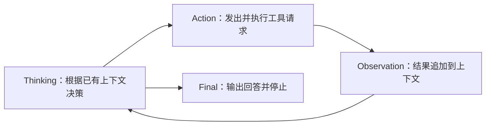

# A01 · ReAct Loop 与上下文增长

用一个加法函数的修复任务，演示工具结果如何成为下一次模型生成的上下文。建议讲解约 2–3 分钟。页面是离线教学仿真，不实际运行测试、修改项目或调用模型；thinking 是编写的简短示意，不是真实隐藏推理记录。

## 屏幕结构

左侧大框表示模型上下文，每个小框是一条 chunk。开场已经有 system prompt、tools、user prompt；随后每次前进只追加一个 chunk。字号固定，超过视口后自动向上滚动。旧内容仍保留，滚出视口不代表删除或压缩。

右上展示 Thinking → Action → Observation → Thinking 的循环，当前阶段高亮。右下展示工具执行说明；下一次 thinking 时保留上一轮结果作为参考。最终回答出现后，循环结束。



## 操作

底部只显示 14 个进度点：初始全部为浅色，每次推进点亮一个；当前步骤的点略大。页面不显示播放按钮、步骤数字或快捷键提示，使用键盘控制。

- `→` / `Space`：前进；`←`：后退。每步动效约 1 秒，随后停住。
- 动画过程中再次前进，只完成当前动作，不额外跳步。
- `P`：重播本步；`R`：重置；`C`：打开或关闭控制；`Esc`：关闭控制。
- 在上下文区域滚动或滑动可回看历史；聚焦上下文后，`↑` / `↓` / `Home` / `End` 也可回看。点击“回到最新”回到底部；下一步自动跟随新增内容。
- 控制面板提供阶段跳转、减少动效与全屏。减少动效时直接显示完整状态。
- URL 保存步骤与动效设置，刷新后恢复。旧 `branch=main` 仍可使用；旧失败分支及越界步骤回到开场。

## 分步讲解

| step | 新增 chunk | 讲解重点 |
|---|---|---|
| 0 | system prompt、tools、user prompt | 先有角色要求、工具目录和用户任务；尚无失败详情。 |
| 1 | thinking：先运行测试 | 模型根据当前上下文决定先复现。 |
| 2 | tool：bash · npm test | 发出并执行请求，还没有测试结果。 |
| 3 | observation：预期 5，实际 -1 | 第一次失败成为新证据；此时还未读取实现。 |
| 4 | thinking：读取对应实现 | 新证据影响下一次决策。 |
| 5 | tool：read · src/add.ts | 请求读取文件，源码尚未返回。 |
| 6 | observation：return a - b | 现在才看到实现，源码成为上下文中的一块。 |
| 7 | thinking：减法改为加法 | 根据读到的代码确定修复。 |
| 8 | tool：edit · a - b → a + b | 修改请求展示具体对照；不提前宣告完成。 |
| 9 | observation：修改已应用 | 修改完成不等于已通过测试。 |
| 10 | thinking：重新运行测试 | 再次验证修复效果。 |
| 11 | tool：bash · npm test | 运行复验，不提前显示通过。 |
| 12 | observation：1 passed | 测试结果追加到上下文，形成可检查的证据。 |
| 13 | thinking：说明修复结果 | 模型根据已收到的测试结果准备回答。 |
| 14 | final：已修复，测试通过 | 输出最终回答并结束循环，共 17 个 chunk。 |

## 推荐停顿

1. 第 3 步：现在知道的是错误表现，还不知道源码原因。
2. 第 6 步：问观众“与第一次生成相比，上下文增加了什么？”可滚回开头对照。
3. 第 9 步：文件已经改了，但还需要验证。
4. 第 12 步：测试结果回到上下文，下一次生成才能据此回答。

共 4 次工具调用、5 次模型生成。thinking 与随后 tool / final 属于同一次生成的教学拆分；“分步播放”不是 API 调用边界。模型调用开始时输入已确定，之后生成的内容和工具反馈累积为后续调用的历史。chunk 类型是教学标签，不对应某个 provider 的原始字段。

## 静态备份

- [初始上下文](stills/01-start.png)
- [源码返回与上下文增长](stills/02-context-grows.png)
- [最终回答](stills/03-complete.png)
- [首次测试失败](stills/04-failure.png)
- [修改请求](stills/05-edit.png)
- [复验通过](stills/06-verified.png)

静态帧由网页的同一份 SVG 场景导出，统一为 1920 × 1080。可只重导本动画，避免改动其他演示：

```sh
NODE_PATH=/path/to/node_modules node PPTs/EP3/export-animation-stills.cjs a01-react-loop
```

HTML 本身没有远程依赖。导出脚本使用开发环境中的 sharp；实际投影前仍建议在现场检查后排可读性。
